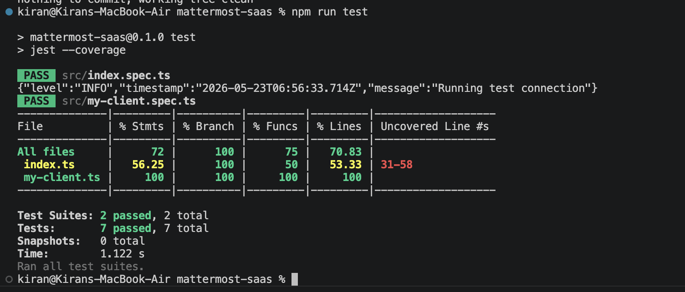

# Mattermost SaaS Connector - TypeScript/Jest Configuration Notes

This project is based on the default SailPoint Connector SDK generated project.  
After generating the base connector, a few changes were required to make the local TypeScript build and Jest test setup work correctly.

## Why These Changes Were Needed

The base SailPoint generated connector project gives a good starting point, but the default TypeScript and Jest configuration may not fully align with the current local Node.js, TypeScript, Jest, and `ts-jest` versions.

During setup, the project had the following issues:

- `ts-jest` preset resolution errors
- Missing Node.js type definitions
- Missing Jest globals such as `describe`, `it`, and `expect`
- TypeScript module resolution warnings
- SailPoint SDK `Context` type mismatch in unit tests
- Compatibility issues between `typescript`, `jest`, and `ts-jest`

The following updates were made to stabilize the development and test environment.

---

## 1. Installed Required Development Dependencies

The project requires TypeScript, Jest, ts-jest, and the proper type definitions.

```bash
npm install --save-dev typescript jest@29 ts-jest@29 @types/jest @types/node
```




## Project Status

This connector is currently in the early development stage.

Completed so far:

- Generated the base SailPoint connector project
- Fixed local npm dependency/cache issues
- Stabilized TypeScript configuration
- Configured Jest with `ts-jest`
- Added Node and Jest type definitions
- Fixed the SailPoint SDK `Context` mock used in unit tests
- Confirmed client unit tests are running successfully with coverage

Current focus:

- Build the Mattermost API client
- Validate connection to Mattermost
- Implement account aggregation
- Map Mattermost users to SailPoint account schema
- Add unit tests for connector operations


## Development Roadmap

### Step 1: Test Connection

Implement a simple connection test against the Mattermost API.

The connector should verify:

- The Mattermost base URL is reachable
- The API token is valid
- The authenticated user has permission to call the API

### Step 2: Account Aggregation

Fetch users from Mattermost and return them as SailPoint accounts.

Expected account fields:

- `id`
- `username`
- `email`
- `firstName`
- `lastName`
- `active`
- `roles`

### Step 3: Get Account

Implement lookup for a single Mattermost user by account ID.

### Step 4: Entitlements

Model Mattermost teams, channels, or roles as entitlements depending on the connector design.

Possible entitlement types:

- Mattermost teams
- Mattermost channels
- Mattermost system roles
- Mattermost team roles

### Step 5: Provisioning

Add create, update, disable, and group/channel assignment operations after aggregation is stable.